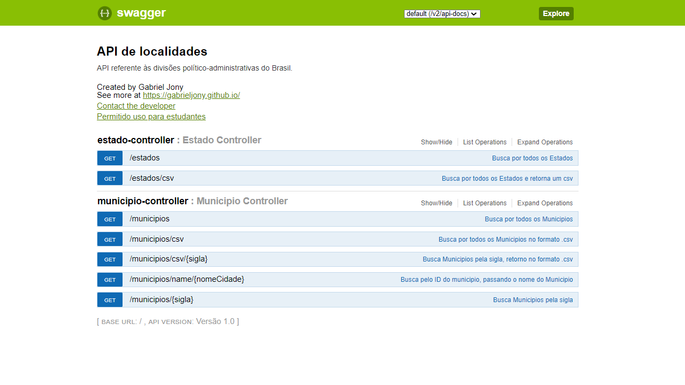

<h1 align="center">
    Challenge Evoluum
</h1>

_________

## 🚀 Sobre o projeto:
O projeto é um desafio para seleção da vaga desenvolvedor Java pela Evoluum.

O desafio consiste em criar um microservice que consulte 2 API externas e gerar um CSV e um JSON para fazer o download.
    
## 💻 Template

## 💫 Links úteis

[IBGE API](https://servicodados.ibge.gov.br/api/docs)

[API IBGE de Localidades](https://servicodados.ibge.gov.br/api/docs/localidades?versao=1)

## 📝 License

Esse projeto está sob a licença MIT. Veja o arquivo [LICENSE](LICENSE.md) para mais detalhes.

---

<h4 align="center">
    Desenvolvido por <a href="https://www.linkedin.com/in/gabriel-jony/">Gabriel Jony</a>
</h4>

  
